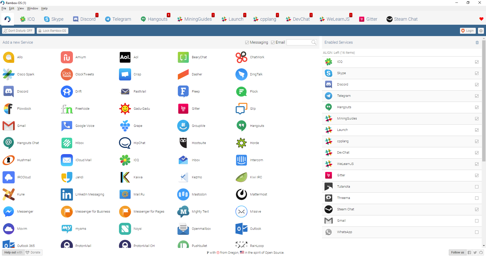
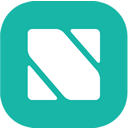
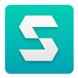
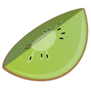

<h1 align="center">
  <br>
  <a href="https://github.com/TheGoddessInari/rambox"></a>
  <br>
  Rambox-OS
  <br>
  <br>
</h1>

<h4 align="center">Free, Open Source and Cross Platform messaging and emailing app that combines common web applications into one.</h4>

<p align="center">
  <a href="https://www.gnu.org/licenses/gpl-3.0.en.html" target="_blank"></a>
  <a href="https://gitter.im/TheGoddessInari/rambox" target="_blank"></a>
  <a href="https://github.com/TheGoddessInari/rambox/releases/latest" target="_blank"></a>
</p>
<p align="center">
  <a href="https://travis-ci.org/TheGoddessInari/rambox" target="_blank"></a>
  <a href="https://ci.appveyor.com/project/TheGoddessInari/rambox" target="_blank"></a>
  <a href="https://david-dm.org/TheGoddessInari/rambox?path=app" title="Dependency status"></a>
  <a href="https://david-dm.org/TheGoddessInari/rambox?type=dev" title="devDependency status"></a>
  
</p>
<h5 align="center">Latest unstable build artifacts are available in Windows 
    <a href="https://ci.appveyor.com/api/projects/TheGoddessInari/rambox/artifacts/dist/Rambox-OS Setup 0.5.18.exe?job=Image%3A%20Visual%20Studio%202017&branch=master" target="_blank">(Win64</a>), Mac (DMG) and Linux 
    <a href="https://ci.appveyor.com/api/projects/TheGoddessInari/rambox/artifacts/dist/Rambox-OS 0.5.18.AppImage?job=Image%3A%20Ubuntu&branch=master" target="_blank">(AppImage64</a> /
    <a href="https://ci.appveyor.com/api/projects/TheGoddessInari/rambox/artifacts/dist/Rambox-0.5.18.x86_64.rpm?job=Image%3A%20Ubuntu&branch=master" target="_blank">RPM64</a> /
    <a href="https://ci.appveyor.com/api/projects/TheGoddessInari/rambox/artifacts/dist/Rambox_0.5.18_amd64.deb?job=Image%3A%20Ubuntu&branch=master" target="_blank">DEB64</a> /
    <a href="https://ci.appveyor.com/api/projects/TheGoddessInari/rambox/artifacts/dist/Rambox-0.5.18.tar.gz?job=Image%3A%20Ubuntu&branch=master" target="_blank">Tarball64</a>) packaging flavors.</h5>

<h6 align="center">Logo designed by <a href="http://andyur.com/" target="_blank">Andriy Yurchenko</a></h6>
<h6 align="center">Original rambox by <a href="https://github.com/saenzramiro" target="_blank">Ramiro Saenz</a></h6>


----------

## Table of Contents

- [Screenshot](#screenshot)
- [Services available - 97](#services-available---97)
- [Features](#features)
- [Privacy](#privacy)
- [Donations](#donations)
- [Translations](#translations)
- [Compiling](#compiling)
- [To Do](#to-do)
- [Contributing](#contributing)
- [Quickstart](#quickstart)
- [Disclosure](#disclosure)
- [Licence](#licence)

----------

## Screenshot




## Services available - 97











<br><br><br><br><br><br><br><br><br><br><br><br><br><br><br><br><br><br><br><br><br><br><br><br><br><br><br><br><br><br><br><br><br><br><br><br><br><br><br><br><br><br><br><br>

## Features

- [ ] Multi-language.
- [ ] Sync your configuration between multiple computers.
- [x] Master Password.
- [x] Lock Rambox-OS if you will be away for a period of time.
- [x] Don't disturb mode.
- [x] Reorder applications in the tab bar.
- [x] Notification badge in the tab.
- [x] Minimize to tray.
- [x] Mute audio to specific service.
- [x] Separate tabs floating to the right.
- [x] Disable a service instead of remove it.
- [x] Start automatically on system startup.
- [x] Custom Javascript injection.
- [x] Custom CSS injection.
- [x] Keyboard Shortcuts.
- [x] Proxy.
- [x] Passive mouse/touch event listeners by default.
- [x] Lowered timer granularity to save CPU time by default.
- [x] No user tracking.
- [x] Fully open source, won't change
- [x] Highly responsive to issues, PRs, and help.
- [x] Offline backup and restore.

## Privacy

No personal information will be saved or tracked.

Sessions will persist using the [partition:persist](https://electronjs.org/docs/api/webview-tag#partition) attribute for Webviews. So every time you open Rambox, your sessions will keep alive until you remove the service.

~~Sync feature use [Auth0](https://auth0.com/) for Single Sign On & Token Based Authentication and to store the services that user is using (and the configuration for each service). You are always welcome to check the code! ;)~~

Auth0 is disabled pending name change and rewrite of the functionality to best preserve your security and functionality.

## Donations
Keep in mind, I'm not pushing this. I'll do my best regardless.

| Type               |                                         URL/Wallet                                         |
|--------------------|:------------------------------------------------------------------------------------------:|
| GoFundMe           | https://www.gofundme.com/rambox-os                                                         |
| Bitcoin            | ```36SxZeQ5dA7Dn6pSmYWcvvmnkEeh8LdgmJ```                                                   |
| Bitcoin Cash       | ```qqslp2vuamhmsp59u49dq89kwky2yj23nqmjr4mdgj```                                           |
| Ethereum           | ```0xa085d5F736f2D7D210261879e183e5bf870Eae5f```                                           |
| Litecoin           | ```MKzytRHYHQTS3qrq2zCggEzSNG3HTbBXZL```                                                   |

## Compiling

To build your own copy, you need:
- An 8.0 version of the [Java SE Development Kit](http://www.oracle.com/technetwork/java/javase/downloads/index.html).
- A recent version of [Ruby](https://www.ruby-lang.org/en/downloads/).
- A recent version of [Sencha CMD](https://www.sencha.com/products/extjs/cmd-download/), and to install it with the Compass extension.
- A recent version of [NodeJS](https://nodejs.org/en/download/) with npm.
These **need** to be added to your PATH.

```shell
git clone https://github.com/TheGoddessInari/rambox.git
cd rambox
npm install
npm run repack:win64
```
You can substitute win64 for linux32, linux64, win32, or osx as desired. This will create an unpacked directory in '**dist**' for testing.

```shell
npm run setup
```

This step instead of **repack** will create an installer appropriate to your platform in '**dist**'.
You can place unpacked files over where the installers normally place their files for development/testing purposes.

**NOTE:** Win32 builds are **deprecated** by electron-builder and are likely to be removed at some point in the future.

## [Contributing](./CONTRIBUTING.md)

Want to report a bug, request a feature, contribute to or translate Rambox? We need all the help we can get! Fork and work!

### Quickstart:

```shell
git clone https://github.com/TheGoddessInari/rambox.git
cd rambox
npm install
npm start
```

See [Contributing.md](./CONTRIBUTING.md) for more detailed information about getting set up.

-------------------

Disclosure
-------------------

Rambox-OS is not affiliated with any of the messaging apps offered.

Licence
-------------------

[GNU GPL v3](https://github.com/TheGoddessInari/rambox/LICENSE)
